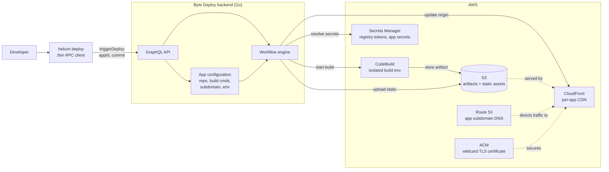

# Lifecycle & Helium Integration

How a Byte storefront goes from "new app" to public URL.

## Mental model

There are three ways an app can move through the platform:

- **UI** — a user clicks "New App from template" in the Byte Deploy dashboard
- **Webhook** — a developer pushes code to the app's GitHub or GitLab repo
- **CLI (later)** — a developer runs `helium deploy` from their terminal

All three go through the same Byte Deploy API and run as workflows inside the platform. The platform owns scaffolding, building, and publishing; the user only ever sees a form, their editor, or their terminal.

```
Trigger paths              Platform workflows           Outcome
─────────────────────      ─────────────────────       ───────────────────

┌──────────────────────┐
│ Byte Deploy UI       │
│ "New App from        │──→ ScaffoldAndDeploy ──→  New app + first deploy
│  template" form      │      workflow              Public URL goes live
└──────────────────────┘

┌──────────────────────┐
│ GitHub / GitLab      │──→ Deploy ─────────────→  Existing app updates
│ push webhook         │      workflow              Public URL serves new code
└──────────────────────┘

┌──────────────────────┐
│ helium deploy        │
│ (future, same        │──→ Deploy ─────────────→  Same as webhook
│  result as webhook)  │      workflow
└──────────────────────┘
```

The platform itself runs the `helium` tool when it needs to scaffold a new project. The user does not install or run helium locally for the demo path.

## Creating a new app (ScaffoldAndDeploy)

What happens when a user creates a new app from a template in the UI.

```
ScaffoldAndDeploy workflow
   │
   ├─ Validate the form
   │     Confirm the chosen options are valid and the user has
   │     a configured GitHub/GitLab connection
   │
   ├─ Scaffold the project
   │     The platform runs the Helium CLI with the form's
   │     choices passed as flags:
   │
   │       helium init --yes \
   │                   --name <app-name> \
   │                   --platform web \
   │                   --router tanstack \
   │                   --renderMode spa
   │
   │     The CLI produces a ready-to-install storefront
   │     project tree.
   │
   ├─ Initialize the repository
   │     Create a git repo on the scaffolded code and record
   │     the first commit
   │
   ├─ Create the remote repository
   │     Open a brand-new empty repo on the user's GitHub or
   │     GitLab account
   │
   ├─ Push the code
   │     Send the initial commit up to the new remote repo
   │
   ├─ Register the webhook
   │     Tell GitHub/GitLab to notify Byte Deploy on future
   │     pushes so subsequent deploys happen automatically
   │
   └─ Hand off to the Deploy workflow
         The first build of the new app starts immediately
         (see next section)
```

When the Deploy workflow finishes, the UI shows the app's public URL.

## Updating an app (Deploy)

What happens when code arrives. The same workflow runs regardless of trigger:

- The end of ScaffoldAndDeploy (the first deploy of a newly created app)
- A `git push` to the app's repo (received via webhook)
- `helium deploy` from a developer's terminal (future — see CLI team note below)

```
Deploy workflow
   │
   ├─ Get the code
   │     Pull the latest commit from the app's repo
   │
   ├─ Ensure the AWS envelope exists  ← IaC tool runs HERE (every deploy)
   │     First deploy of a new app: the IaC tool provisions
   │     the CloudFront distribution, S3 prefix, DNS record,
   │     IAM role, and log group (Terraform or Pulumi).
   │     State is saved after each resource so a mid-flight
   │     failure leaves a recoverable checkpoint for the
   │     next attempt.
   │     CloudFront propagation adds 10-15 minutes on first
   │     deploy only.
   │
   │     Every subsequent deploy: the IaC tool runs a
   │     refresh-and-plan that no-ops in ~1 second when
   │     nothing has drifted — also catches manual
   │     AWS-console changes.
   │
   ├─ Build the app
   │     Run a clean build in an isolated environment:
   │     install dependencies, compile, output static files
   │
   ├─ Wait for the build to finish
   │     Builds typically take one to three minutes
   │
   ├─ Validate the build output
   │     Check the build produced everything the platform
   │     needs (entry point, static assets, health check)
   │
   ├─ Upload the assets
   │     Move static files to fast storage reachable by the
   │     content delivery network
   │
   ├─ Smoke test the new version
   │     Hit a health check on the new version before any
   │     real user traffic touches it
   │
   └─ Switch the app over
         Point the CDN at the new version
         (the public URL serves the new code from here on)
```

The switchover is a pointer move — the platform simply tells the CDN "serve this version now." Nothing is rebuilt at switchover, which keeps activation fast and makes rollback in a future release straightforward (point at an older version).

> **CLI team dependency — `helium deploy` does not exist yet.**
>
> The Deploy workflow above can run today from the UI ("New App" → first deploy) and from a `git push` webhook. The third trigger — `helium deploy` from a developer's terminal — is **CLI team work that needs to land in evolution-mvp**.
>
> A minimum useful version is small: a command that reads an auth token from an environment variable, takes the app ID as a flag, calls Byte Deploy's `triggerDeploy` endpoint with the current commit, and streams status events back. Convenience wrappers like `helium login` (store the token) and `helium link` (store the app ID per project) are ergonomics on top and can come later — they're not blocking.
>
> `helium deploy` itself is not on the v1 demo critical path. The demo runs entirely via UI and webhook. The CLI deploy command becomes valuable once developers are working in the platform day-to-day; until then the backend Deploy workflow is the same regardless of trigger.

## Where helium fits

The `helium` CLI is the tool that scaffolds new storefront projects. In v1 it runs **inside Byte Deploy's workflow infrastructure** — when a user clicks "New App," the platform runs `helium init` on their behalf with the form's parameters. The user never needs to install helium for the demo path.

In a later version, developers will also be able to run `helium deploy` from their own terminals as an alternative to `git push`. That command sends a deploy request to Byte Deploy's API; the workflow that runs afterwards is identical to the webhook path. The helium tool itself is the same binary in both contexts; only who triggers it changes.

The deploy half of the lifecycle (build → validate → upload → switch) does not involve helium at all. Once the code is in a repo, Byte Deploy handles everything.

## AWS services and the helium deploy integration

When a deploy is triggered (by the UI, a webhook, or `helium deploy`), the Byte Deploy backend orchestrates a workflow that uses several AWS services. `helium deploy` is a thin remote control — it carries no deploy logic and knows nothing about AWS. All configuration (which repository to clone, which build commands to run, which subdomain to serve at, which secrets to inject) lives in the backend; the CLI only sends the app ID and the commit reference.



What each piece does:

- **Byte Deploy backend** owns every app's configuration and orchestrates every deploy. The CLI only knows the app ID and a commit; the backend fills in the rest.
- **CodeBuild** runs the app's build (install, compile, bundle) in a clean isolated environment, separate from the backend itself.
- **S3** stores both the build artifacts (for forensics and reuse) and the static assets (HTML, JS, CSS) that the CDN serves to end users.
- **CloudFront** is the per-app CDN — each app has its own distribution that the backend updates when a new version is ready.
- **Route 53** holds the platform's subdomains (e.g., `my-app.preview.byte.yum`).
- **ACM** provides the wildcard TLS certificate that secures every app's URL.
- **Secrets Manager** stores credentials the backend or the build needs (the private package registry token, VCS tokens, future app-level secrets).

The split is: **the backend talks to AWS; the CLI talks to the backend.** A change in AWS service choice, region, or configuration never requires a CLI update — only a backend update.

### How AWS resources are actually created

The backend does not create CloudFront distributions, S3 prefixes, DNS records, IAM roles, or log groups by clicking the AWS console — they're managed by an **Infrastructure as Code (IaC) tool**. The platform uses either **Terraform** or **Pulumi**; the choice will be locked in Week 1 via a short spike. Either tool produces the same AWS resources via the same AWS APIs underneath.

The IaC tool runs on **every deploy**, inside the "Ensure the AWS envelope exists" step above. On the first deploy it provisions the envelope, saving state after each resource so a mid-flight failure leaves a recoverable checkpoint. On every subsequent deploy it runs a refresh-and-plan that no-ops in ~1 second when nothing has drifted — also catching manual AWS-console changes in the same uniform step. All other deploy steps (build trigger, asset upload, CDN origin update) call AWS directly through the SDK — no IaC tool involved.

### Looking ahead — mobile app deployments

The same pattern extends naturally to native apps. `helium init` already exposes an Expo (React Native) platform option, so the scaffolding side is in place. For mobile deploy, the AWS column above would be joined by mobile-specific services: a managed build service such as Expo EAS for the build step, the Apple App Store Connect API and Google Play Console for store submission, and an over-the-air update channel (Expo Updates or CodePush) for incremental code changes that don't need a new store release.

The split stays the same — the CLI carries an app ID and a commit; the backend holds the configuration for which platforms to target, which provisioning profiles and signing keys to use, and which release channels to publish to. Adding native deployment is a new workflow type registered on the same chassis (the existing workflow registry pattern from Phase 1 makes this additive), not a re-architecture. Mobile is on the v1.1+ roadmap; the v1 chassis is being built so it can absorb it.

## What's out of scope for v1

The lifecycle stops at "app is live and updating on every push." The following are deliberately deferred:

- Multiple environments per app (staging + production)
- Promotion between environments
- Rollback to a previous version
- Approval gates before deployment goes live
- Pull-request preview URLs
- Deleting/tearing down an app from the UI

Each of these is additive on the same chassis and lands in v1.1 or later.
