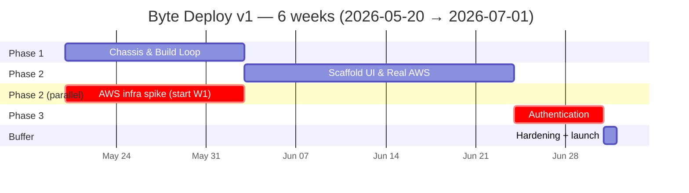

# Phases & Tasks — Path to July 1

**Fresh-start project.** This roadmap is for a new repository. The existing `byte-deploy` work is inspiration only — every task below is designed to be implemented from scratch, with no assumption that any code already exists.

**Three phases, ~30 tasks, 6 weeks.** Each task is a single, scoped piece of work with a **Title**, a one-line **Description**, and a flat **Acceptance criteria** checklist. No file paths, no implementation specifics. Ready to paste into Jira or Linear.

1. **Phase 1 — Chassis & Build Loop:** project chassis, domain model, persistence, workflow framework, VCS connections with write scopes, a single deploy workflow (no approval, no snapshot, no rollback), CodeBuild-backed build plane, scaffold-via-Helium activity.
2. **Phase 2 — Scaffold UI & Real AWS Envelope:** UI-triggered ScaffoldAndDeploy workflow, `helium deploy` server contract, per-app CloudFront + S3 + Route 53 + ACM envelope on real AWS, real-app proof.
3. **Phase 3 — Authentication:** token verification, RBAC, cross-tenant matrix.

## When the URL actually comes alive

| Milestone | What's live | When |
|---|---|---|
| End of Week 2 (Phase 1 demo) | A test app deploys via webhook against real AWS — push code, live URL on real DNS. Single hand-written repo, no UI scaffolding. | **June 1** |
| End of Week 5 (Phase 2 demo) | The full Vercel demo: click "New App," scaffolded code lands in a fresh GitHub repo, public URL on `*.preview.byte.yum`. | **June 22** |
| End of Week 6 (Phase 3 demo, v1 launch) | Same as Phase 2, gated by real SSO + RBAC. | **July 1** |

A live URL exists from Week 2 onward. The launch date is gated on auth + the full UI-driven demo, not on whether deploy works — giving roughly three weeks of buffer between first-live-URL and launch.

**Scope locked 2026-05-20:**

- **The demo is "click 'New App' → public URL with own subdomain"** — UI-driven scaffold-then-deploy is the critical path, not deploy-of-existing-repo.
- **Helium CLI is the integration surface.** Scaffold activities exec `helium init` (binary baked into the worker image). byte-deploy never invokes `helium deploy` — that is a separate client of byte-deploy's API.
- **Upstream dependency on evolution-mvp** — two pieces, both blocking the demo path:
  1. **The CLI must be published.** `tooling/cli/package.json` is currently `"private": true`; it must be added to the publishable packages list so byte-deploy's worker image can install it from the GitLab registry.
  2. **The CLI must emit ready-to-run scaffolds.** No `workspace:*` or `catalog:*` references in any `package.json`. The rewrite happens inside the CLI at publish time, not in byte-deploy.
- **Real AWS in v1.** Per-app CloudFront + S3 + Route 53 wildcard subdomain. Pulled in from the original v1.1 deferral list because LocalStack URLs don't sell the demo.
- **No multi-environment, no promotion, no rollback, no approval.** Single environment per app. Deferred to v1.1.
- **SPA only** per [D-004](./04-decisions.md#d-004). Lambda SSR runtime deferred.
- **Self-hosted Temporal locally for development.** Production cluster deferred to v1.1.
- **Auth is the last phase.** Bearer-token stub through Phases 1–2.

## Schedule

The AWS infrastructure spike (per-app envelope shape, CloudFront propagation timing, ACM wildcard, Route 53 records) **starts in Week 1 in parallel with Phase 1**, not in Phase 2. AWS provisioning is the highest-unknown-cost work; delaying it to Week 3 is the surest way to slip July 1.

---

# PHASE 1 — Chassis & Build Loop (Weeks 1–2)

**Goal:** The new project's chassis is up. Domain, persistence, the workflow framework, and a single deploy workflow exist. The worker can scaffold a project by exec'ing `helium init`. A push-to-deploy flow lands a build artifact in real S3, served behind real CloudFront against a temporary test subdomain. No UI for scaffolding yet — that's Phase 2.

## P1.1 — Project chassis

**Description:** Stand up the new repository, monorepo structure, services, local development stack, and continuous integration.

**Acceptance criteria:**
- [ ] Monorepo holds the product API, the worker, and the web app
- [ ] One command brings up all local dependencies (data store, orchestration, observability)
- [ ] Hello-world API responds to a query
- [ ] Hello-world workflow runs in the orchestrator and is visible in its UI
- [ ] Web app serves a starter page
- [ ] CI pipeline lints, tests, and builds on every change
- [ ] Health endpoints exist on every service and report dependency status

## P1.2 — Domain model and persistence

**Description:** Define the core aggregates (App, Deployment, Connection, BuildJob) in code and persist them with multi-tenant access patterns. Environment exists as a single placeholder per app so v1.1 multi-env is additive.

**Acceptance criteria:**
- [ ] Each aggregate enforces its invariants in code
- [ ] Aggregates have no infrastructure dependencies
- [ ] Cross-aggregate references are by ID
- [ ] App carries a single default Environment record; no UI to create or list multiple
- [ ] Persistence layer supports the access patterns the product needs (list apps in a tenant, list deployments by app, lookup current release for an app)
- [ ] No Release supersession, no rollback pointer chain; "current release" is a single pointer per app
- [ ] A documented model is readable by a new engineer in under fifteen minutes

## P1.3 — Tenant-scoped data access

**Description:** All reads and writes enforce tenant isolation at the data layer, independent of API authorization (which arrives in Phase 3).

**Acceptance criteria:**
- [ ] Every read enforces tenant scope from the request context
- [ ] Cross-tenant reads return "not found" (no existence leak)
- [ ] List queries return only the caller's tenant's data
- [ ] A test that bypasses the API still cannot read another tenant's data
- [ ] A linting or equivalent guardrail catches new data-access functions that forget the scope check

## P1.4 — Orchestration framework with registry

**Description:** Set up the orchestration layer with a registry pattern so adding new workflow types is an additive change.

**Acceptance criteria:**
- [ ] Workflows register themselves at startup
- [ ] Adding a workflow type requires no edits to core wiring
- [ ] Each workflow can declare its activities, timeouts, and retry policies
- [ ] Registration order does not matter
- [ ] Every workflow is tagged at start with tenant, app, deployment, and source
- [ ] Distributed traces stitch API request → workflow → activity → external call without manual correlation
- [ ] A documented convention exists for how new workflows are added

## P1.5 — VCS connections with write scopes

**Description:** Operators can connect the platform to GitHub and GitLab repositories with credentials that permit both reading code and creating repositories + pushing initial commits.

**Acceptance criteria:**
- [ ] Supports GitHub App, GitLab OAuth, and personal-access-token connections
- [ ] Credentials stored securely; never returned to the client
- [ ] Connections request and verify write scopes: `contents:write` + `administration:write` for GitHub; `api` + `write_repository` for GitLab
- [ ] The platform can clone a repository at a given commit using any connection type
- [ ] The platform can create a new remote repository under a configured org/user using any connection type
- [ ] The platform can push an initial commit to a newly created remote
- [ ] Webhook receivers for each provider authenticate incoming requests
- [ ] Multiple tenants can each configure their own connections without collision

## P1.6 — Deploy workflow (single environment, no promotion)

**Description:** Build the deploy workflow with a clear stage map. Each stage transition is durable, observable, and resumable. No approval gate, no environment snapshot, no rollback path in v1.

**Acceptance criteria:**
- [ ] The workflow has named stages with explicit transitions: source resolved → built → smoke verified → activated → succeeded
- [ ] Workflow ID is `deploy:{appId}:{sourceDigest}` for idempotency
- [ ] Each stage transition is durable; a worker crash does not lose progress
- [ ] Failure at any stage produces a clear terminal state with the reason recorded
- [ ] Retry policies are appropriate per stage and documented
- [ ] **Activation is a pointer flip**, not a rebuild — the active-release pointer for the app is updated atomically once smoke passes
- [ ] A state-machine diagram is included in the design doc
- [ ] A successful deploy serves a recognizable bundle at a stable temporary URL backed by real S3 + CloudFront

## P1.7 — Scaffold activity via Helium CLI

**Description:** A standalone Temporal activity that, given a `ProjectDefinition`, exec's `helium init` and returns the path to a scaffolded project tree. Used later by ScaffoldAndDeploy (P2.2).

**Acceptance criteria:**
- [ ] Activity accepts a typed `ProjectDefinition` (platform, router, renderMode, name, target path)
- [ ] Activity exec's `helium init` non-interactively using `--yes` plus explicit flags
- [ ] Activity asserts the CLI binary is present on PATH and reports a clear error if not
- [ ] Activity captures stdout + stderr and surfaces the CLI's failure message on non-zero exit
- [ ] Activity returns the absolute path to the scaffolded tree, ready for downstream activities
- [ ] Activity validates that the scaffolded tree contains no `workspace:*` or `catalog:*` references in any `package.json`, and fails clearly if it does (contract enforcement against the CLI; rewrite work itself belongs upstream)
- [ ] Activity is idempotent at the path level — re-invoking with the same path either no-ops or fails cleanly
- [ ] Activity has an integration test that runs against a real `helium` binary in CI

## P1.8 — Build manifest contract

**Description:** Lock a stable JSON contract that every build emits so downstream stages and the UI can rely on it.

**Acceptance criteria:**
- [ ] Schema is versioned and documented
- [ ] Required fields cover: app identity, commit, framework, render mode, static asset prefix, runtime entry, healthcheck path, build duration
- [ ] Manifest records the resolved `@byte-storefronts/*` platform-pool major (for forensics on which SDK generation built the app)
- [ ] Builds that emit a non-conforming manifest fail with a clear error before activation
- [ ] Schema is readable by both the build process and the product

## P1.9 — Build job tracking

**Description:** Each build is a first-class domain object with its own lifecycle and metadata.

**Acceptance criteria:**
- [ ] Every build creates a tracked record at start
- [ ] The build job moves through queued → running → (succeeded | failed | cancelled) with no skipped transitions
- [ ] The job links back to the deployment that triggered it
- [ ] Cross-tenant lookups return "not found"
- [ ] The job carries enough metadata to debug a failed build without re-running it (CodeBuild ID, log group, manifest reference)

## P1.10 — Build plane on CodeBuild

**Description:** Builds run in CodeBuild, not in the Temporal worker. The worker triggers CodeBuild jobs and polls or signals on completion. Build invocation goes through a single interface so the v1.1+ build plane can be swapped without changing the workflow code.

**Acceptance criteria:**
- [ ] Build invocation goes through a single named interface
- [ ] The v1 implementation is a CodeBuild project shared across apps, with build role scoped per-build to the app's S3 prefix and SSM path
- [ ] Workflow code contains no build-tool-specific logic
- [ ] Build inputs (source tarball location, repo URL, commit, `RepoConfig`) pass cleanly through the interface
- [ ] Build credentials and `BYTE_HELIUM_TOKEN` for private package install are injected by CodeBuild from Secrets Manager — never present in the user repo or logs
- [ ] CodeBuild logs forward to ClickStack with the deployment ID as a structured field
- [ ] Failed builds produce inspectable artifacts (last source tarball, partial output) that survive worker restarts

## P1.11 — Registry credentials and worker image

**Description:** Two distinct consumers of `BYTE_HELIUM_TOKEN` — the worker image at build time (to install the `helium` CLI) and CodeBuild at runtime (to install each app's `@byte-storefronts/*` deps). Both paths must work without the token landing in any image, repo, or log.

**Acceptance criteria:**
- [ ] Worker container image is built in CI with `BYTE_HELIUM_TOKEN` as a build secret; `helium`, `git`, and `pnpm` are present in the final image; the token is not
- [ ] Worker image pins a specific version of `@byte-storefronts/cli`; version bumps are deliberate
- [ ] CodeBuild start step writes a temporary `.npmrc` from a Secrets Manager value, runs `pnpm install`, then removes the file before any user-defined step
- [ ] An app whose `package.json` lists `@byte-storefronts/*` packages installs cleanly in CodeBuild
- [ ] Credentials never appear in logs or error messages from either path
- [ ] A credential rotation procedure is documented (worker image rebuild + Secrets Manager value update)

### Phase 1 demo (end of Week 2)

Push-to-deploy on a known-good repo: clone → CodeBuild → manifest → upload to real S3 → flip real CloudFront origin → serving URL responds. ScaffoldActivity (P1.7) is invokable from a test harness and produces a buildable project tree, but is not yet wired into a user-facing workflow.

### Phase 1 exit criteria

- Project chassis up; domain, persistence, and tenant scoping in place
- Single deploy workflow working end-to-end on real AWS for one test app
- CodeBuild build plane operational with registry creds plumbed
- ScaffoldActivity validated against a fresh `helium init` output

---

# PHASE 2 — Scaffold UI & Real AWS Envelope (Weeks 3–5)

**Goal:** The Vercel-style demo works. A user clicks "New App from template" in the UI, picks framework parameters, byte-deploy scaffolds the project via `helium init`, pushes to a fresh remote repo, runs the deploy workflow, and a public URL resolves at an app-scoped subdomain. A subsequent `git push` to the repo redeploys via webhook. If the CLI team ships `helium deploy` in time, it serves as a third trigger of the same workflow; that path is not on the demo critical path.

## P2.1 — Multi-tenant attributes on apps

**Description:** Apps carry the tenant filter dimensions: brand, market, channel.

**Acceptance criteria:**
- [ ] Each app records brand, market, and channel
- [ ] App lists can filter by any combination of those three
- [ ] App creation captures all three
- [ ] Existing apps backfill with sensible defaults

## P2.2 — ScaffoldAndDeploy workflow

**Description:** A new top-level workflow that orchestrates scaffold → repo creation → push → webhook registration → deploy. Composes P1.7 (scaffold activity) with new activities and chains the existing P1.6 deploy workflow as a child.

**Acceptance criteria:**
- [ ] Workflow accepts a `ProjectDefinition` + a target VCS connection + an app name + tenant attributes
- [ ] Stages, in order: validate input → scaffold (P1.7) → git init + commit → create remote repo → push initial commit → register webhook → child(Deploy)
- [ ] Each stage is a durable activity; a worker crash does not lose progress
- [ ] If any stage fails, the workflow records a clear failure reason and stops; partial side effects (created repo, pushed commit) are surfaced for operator cleanup
- [ ] Created repo URL, default branch, and initial commit SHA are recorded on the App aggregate
- [ ] Per-app mutex: one ScaffoldAndDeploy may run per `(tenantId, appName)` at a time

## P2.3 — "New App from template" UI

**Description:** A web form in the byte-deploy UI that collects a `ProjectDefinition` and triggers ScaffoldAndDeploy.

**Acceptance criteria:**
- [ ] Form captures app name, brand, market, channel, target VCS connection, platform (web/expo), router, renderMode
- [ ] Available router × renderMode combinations are sourced from the CLI's `WEB_CAPABILITIES` (no hand-maintained list in byte-deploy)
- [ ] Submission starts a ScaffoldAndDeploy workflow and navigates to a status page
- [ ] Status page streams stage transitions in real time
- [ ] Final state shows the public URL, the created VCS repo URL, and a link to the deployment detail
- [ ] Failures show the failed stage and the operator-actionable error

## P2.4 — `helium deploy` server contract

**Description:** A minimum API surface that lets the developer-facing `helium deploy` command trigger deploys against an existing app. v1 is commit-ref based (the developer has pushed code; the CLI tells byte-deploy to deploy that commit). The richer source-tarball upload path (Vercel-style "deploy uncommitted code") is v1.1+.

**Acceptance criteria:**
- [ ] `triggerDeploy(appId, commitRef)` mutation starts the Deploy workflow with idempotency key `deploy:{appId}:{commitSha}`; returns `deploymentId` + `workflowId`
- [ ] `deploymentEvents(deploymentId)` subscription streams stage transitions to clients
- [ ] Both surfaces are RBAC-gated against the caller's tenant and `deployer` role (RBAC stub passes through until Phase 3)
- [ ] Re-triggering with the same `commitSha` returns the same workflow execution, not a new one
- [ ] **Deferrable** — if scope slips, this task moves to v1.1. The demo runs without `helium deploy`.

## P2.5 — Smoke test before activation

**Description:** Before flipping the active-release pointer, the platform verifies the inactive version responds.

**Acceptance criteria:**
- [ ] The smoke step runs against the inactive version, not the live one
- [ ] Asserts a successful response within a reasonable time
- [ ] Retries transient failures briefly before giving up
- [ ] A failed smoke ends the deployment without activating
- [ ] Optional per-app healthcheck path overrides the default

## P2.6 — Per-app deploy mutex

**Description:** Two simultaneous deploys to the same app cannot both run. (Simpler than per-environment, since v1 has one env per app.)

**Acceptance criteria:**
- [ ] Triggering a second deploy to the same app while one is in flight returns a clear "deploy in progress" error
- [ ] Different apps can deploy in parallel
- [ ] The behavior survives worker restarts

## P2.7 — Automatic webhook registration

**Description:** Attaching a VCS connection to an app sets up the webhook automatically. ScaffoldAndDeploy registers it as part of the new-app flow; existing apps can register on demand.

**Acceptance criteria:**
- [ ] On connection attach or scaffold completion, the platform registers a webhook with the provider
- [ ] Supported events: push to default branch
- [ ] Re-attaching detects an existing webhook and does not duplicate it
- [ ] Webhook registration failure surfaces in the UI but does not block the attach

## P2.8 — Garbage collection workflow

**Description:** A scheduled cleanup keeps artifact storage bounded.

**Acceptance criteria:**
- [ ] Runs on a daily schedule
- [ ] Removes failed-build artifacts after a retention window
- [ ] Ages out old source tarballs
- [ ] Retains a minimum number of recent successful artifacts per app (default: 20)
- [ ] Reports per-run metrics (items examined, removed, bytes freed)

## P2.9 — AWS account, base networking, and per-app envelope

**Description:** Provision the AWS account(s), VPC, base IAM roles, and the per-app envelope module (CloudFront distribution, S3 static prefix, IAM runtime role, log group, SSM path). The platform itself runs out of one chosen AWS account; per-tenant account isolation is deferred ([D-007](./04-decisions.md#d-007)).

**Acceptance criteria:**
- [ ] AWS account exists and is access-controlled
- [ ] VPC, subnets, and security groups documented and provisioned via infrastructure-as-code
- [ ] Base IAM roles for platform services exist with least-privilege policies
- [ ] Cost budgets and CloudWatch billing alarms configured
- [ ] Per-app infrastructure module exists, is idempotent, and provisions cleanly in one shot
- [ ] First-time provisioning latency documented (CDN propagation can be 10–15 min; surfaced in UI as "provisioning")
- [ ] An app's runtime URL is the real DNS name (no LocalStack fallback)
- [ ] App deletion cleanly removes its envelope

## P2.10 — Domain, Route 53, and TLS

**Description:** Wire up the real domain so apps deploy at real subdomains. Per [D-005](./04-decisions.md#d-005), default to `*.preview.byte.yum` for v1.

**Acceptance criteria:**
- [ ] Chosen domain is hosted in Route 53
- [ ] Wildcard ACM certificate issued in `us-east-1` for the chosen environment kind
- [ ] DNS validation records in place
- [ ] A test app resolves correctly to its CloudFront distribution
- [ ] Domain ownership documented; rotation contact identified

## P2.11 — Environment hosting provider configuration

**Description:** The per-app Environment record carries the hosting target (AWS account / region, DNS zone, TLS certificate reference, CDN settings, monitoring destination). For v1 there is a single default provider; the schema is forward-compatible with per-environment overrides in v1.1.

**Acceptance criteria:**
- [ ] Each Environment carries hosting provider fields, defaulting to the platform's shared AWS configuration
- [ ] An operator can validate a provider configuration: a non-destructive read against the configured target reports success or a specific error
- [ ] Credentials are stored in Secrets Manager; never returned to the client
- [ ] Provider configuration changes take effect on the next deploy, not retroactively
- [ ] Every change is recorded in the audit log
- [ ] A decision record explains the provider abstraction and what changes when v1.1 swaps in per-tenant providers

## P2.12 — Real-app end-to-end validation

**Description:** Prove every flow on a real storefront. This is the launch-readiness gate.

**Acceptance criteria:**
- [ ] A real storefront is scaffolded from the byte-deploy UI ("New App from template") and lands a public URL within the agreed time budget
- [ ] The scaffolded repo is visible in GitHub or GitLab with the initial commit and webhook attached
- [ ] Push to the main branch of that repo triggers a deploy that lands at the same URL within the agreed time budget
- [ ] *Conditional on P2.4 shipping:* `helium deploy` from a developer's terminal triggers the same deploy workflow and prints the URL on completion
- [ ] Forcing a failed build produces a clear error and does not corrupt prior state
- [ ] Two simultaneous deploys to the same app cannot both run
- [ ] Cross-tenant reads return "not found" (data layer; full auth arrives in Phase 3)
- [ ] The operator runbook captures the run with screenshots and timings

### Phase 2 demo (end of Week 5)

Live for stakeholders, about ten minutes total:
1. Click "New App from template" in the UI, pick TanStack/SPA, name it, submit
2. Watch the workflow scaffold, push to a fresh GitHub repo, build, and serve at a public URL
3. Open the URL — the scaffolded storefront loads
4. Edit code locally on the cloned repo, `git push` — webhook triggers redeploy, URL updates
5. *Optional, if P2.4 and the CLI team's `helium deploy` are both ready:* trigger the same redeploy from the terminal

### Phase 2 exit criteria

- One real storefront live; UI scaffold + webhook trigger both proven end-to-end
- Real AWS envelope working: CloudFront, S3, Route 53, ACM all under operator control
- Operator runbook published

---

# PHASE 3 — Authentication (Week 6)

**Why this is last:** The chassis hardens against a stub identity model; real authentication and RBAC swap in at the end. **Hard rule:** no real tenant data lands before this phase ships.

**Dependency:** The identity provider team has supplied JWKS endpoint, audience, issuer, role mapping, and test accounts by start of Week 6.

## P3.1 — Token signature verification

**Description:** Replace the stub identity model with real signature verification of incoming tokens.

**Acceptance criteria:**
- [ ] Signing keys are fetched from the identity provider and cached
- [ ] Token signature is verified against the right key
- [ ] Issuer and audience claims must match expected values
- [ ] Expired or malformed tokens are rejected with clear errors
- [ ] All rejection paths covered by tests

## P3.2 — Role and permission model

**Description:** Define the role taxonomy and how it maps to product permissions.

**Acceptance criteria:**
- [ ] Roles defined: organization admin, app admin, deployer, viewer
- [ ] Permissions cover app, deployment, connection, and analytics actions
- [ ] Mapping from role to permissions documented in a decision record
- [ ] Every role × every permission combination covered by tests

## P3.3 — API-layer permission enforcement

**Description:** The product API rejects mutations the caller's role cannot perform.

**Acceptance criteria:**
- [ ] Each mutation declares the permission it requires
- [ ] Calls without the required permission return "forbidden"
- [ ] Failure responses do not leak whether a resource exists
- [ ] Every existing mutation is classified and protected, including `createAppFromTemplate`, `triggerDeploy`, and `createUploadUrl`

## P3.4 — Command-layer permission enforcement

**Description:** A second permission check runs at the command layer so test or internal bypasses of the API still fail.

**Acceptance criteria:**
- [ ] Every command handler re-checks the actor's permission before doing work
- [ ] Bypassing the API to call a command directly returns "forbidden" when the actor lacks the permission
- [ ] Missing the check fails the build

## P3.5 — Apply RBAC to existing mutations

**Description:** Connection management and scaffold/deploy actions become real RBAC-gated operations.

**Acceptance criteria:**
- [ ] Connection create/delete requires the integration-management permission
- [ ] `createAppFromTemplate` requires app-admin or higher
- [ ] `triggerDeploy` requires deployer or higher
- [ ] Viewer role on any write action returns "forbidden"
- [ ] Cross-tenant connection or app actions return "not found"

## P3.6 — Cross-tenant security matrix

**Description:** A test matrix proves every permission boundary holds.

**Acceptance criteria:**
- [ ] Test fixture includes two tenants with realistic data
- [ ] Matrix covers every role × every mutation × both tenant boundaries
- [ ] Forbidden paths return "forbidden"; not-found paths return "not found"
- [ ] No operation in the matrix succeeds unexpectedly

## P3.7 — Auth ADR and end-to-end re-validation

**Description:** Document the locked design and re-run Phase 2 flows under real authentication.

**Acceptance criteria:**
- [ ] Decision record published covering signing-key handling, role taxonomy, defense in depth, and cross-tenant posture
- [ ] Audit log captures the actor's role alongside their identity
- [ ] Phase 2 happy path runs end-to-end under real SSO with no regression in user-perceived latency
- [ ] Operator runbook updated to cover real login

### Phase 3 demo (end of Week 6)

Operator logs in via real SSO → token verified server-side → viewer role gets "forbidden" on `createAppFromTemplate` → deployer role triggers a deploy → Phase 2 flows still work under real auth.

### Phase 3 exit criteria

- All product APIs gated by RBAC
- Only unauthenticated paths are health checks and webhook endpoints
- Cross-tenant matrix all passes
- Auth decision record published

---

# Deferred to v1.1

Documented so nothing is lost. Each is a discrete post-launch effort.

| Deferred item | Reason |
|---|---|
| Multi-environment (staging + production split) | Cut from v1 scope; v1 has one Environment per app |
| Promotion workflow | Tied to multi-env; defer |
| Rollback workflow | Defer; v1's "current release" is a single pointer with no history-aware restore |
| Approval gate + approval lifecycle + queue UI | Cut from v1 scope |
| Environment snapshot per deployment | Only useful with rollback; defer with it |
| PR previews (workflow + UI) | High orchestration cost; demo doesn't need them |
| Server-side rendering runtime (Lambda + alias) | SPA-only per [D-004](./04-decisions.md#d-004) |
| Production Temporal cluster on shared infrastructure | Local self-hosted is the v1 stack |
| Native release support (Expo, Apple, Google) | Original Phase 4 |
| Platform intelligence (risk scoring, AI failure diagnosis) | Original Phase 5 |
| Visual Builder feature | Future scope; chassis is ready |
| Federated graph publication | Schema is federation-ready; publication later |
| Per-tenant AWS accounts / VPC isolation | Namespaced isolation for v1 ([D-007](./04-decisions.md#d-007)) |
| Custom customer domains | Platform-owned domain only in v1 |
| Per-PR backend ephemeral environments | Frontend previews only — and even those deferred |

---

# Path to v1.1

When the project moves past v1, the work below happens roughly in this order. **None of it is in v1.**

## V1.1.1 — Multi-environment

**Description:** Add `Environment` as a first-class aggregate per app, with branch restrictions, env-specific hosting configuration, and per-environment release pointers. Existing single-env apps backfill to a "default" environment.

## V1.1.2 — Promotion + Rollback

**Description:** Bring back the two pointer-flip workflows from the original plan. The chassis already activates by pointer flip, so promotion is "flip the pointer of env B to point at the release of env A," and rollback is "flip the pointer of env X to a previous release." Both are additive on the existing workflow registry.

## V1.1.3 — Approval gate

**Description:** Per-environment approval policy + lifecycle + queue UI + approve/reject API. Original P2.2–P2.6, restored.

## V1.1.4 — Environment snapshot per deployment

**Description:** Capture resolved environment values into the deploy record so rollback is deterministic. Only useful once V1.1.2 lands.

## V1.1.5 — SSR runtime

**Description:** Lambda function shell per app, alias movement on activation, cold-start measurement. Wires into the existing per-app envelope alongside the S3 static origin.

## V1.1.6 — PR previews

**Description:** Preview workflow + UI from the original P2.11/P2.13.

## V1.1.7 — Production Temporal cluster

**Description:** Stand up the orchestration cluster on shared production infrastructure per the discipline locked in [D-001](./04-decisions.md#d-001).

## V1.1.8 — Production cutover for the platform itself

**Description:** Move the platform from local-dev orchestration to the production Temporal cluster with no data loss.

---

# Plug points for the future Builder

The chassis supports the Builder additively, no architectural changes:

1. A new workflow type (Builder Apply) registers via the workflow registry from Phase 1
2. A new mutation on the product API — additive, doesn't touch existing types
3. Source attribution on deployments is open-ended (a new source value is a constant, not a schema change)
4. Per-app serialization comes for free from the deploy mutex pattern
5. Edit history fits the existing audit and aggregate patterns
6. The platform-library invocation pattern from P1.7 (Helium CLI as scaffold) is the same pattern Builder will reuse for patch application

**Estimated post-v1 Builder effort:** about two weeks for one engineer, given the v1 chassis.

---

# When something slips

Priority:

1. Cut acceptance criteria from the slipping task. Each task can ship at 80%.
2. Defer P2.4 (`helium deploy` server contract) — the demo runs from the UI; CLI deploy is nice-to-have, not load-bearing.
3. Defer P2.8 (GC workflow) — artifacts will pile up; one week of pile-up is tolerable.
4. Cut the operator-runbook acceptance criterion from P2.12.
5. Push the launch date — only after the above are exhausted.

**Non-negotiable tasks:** P1.1, P1.2, P1.3, P1.4, P1.5, P1.6, P1.7, P1.8, P1.10, P1.11, P2.1, P2.2, P2.3, P2.5, P2.9, P2.10, P2.12, P3.1, P3.3, P3.4, P3.6. Without these, v1 is not safely shippable.

**P2.12 cannot move.** It is the proof.
